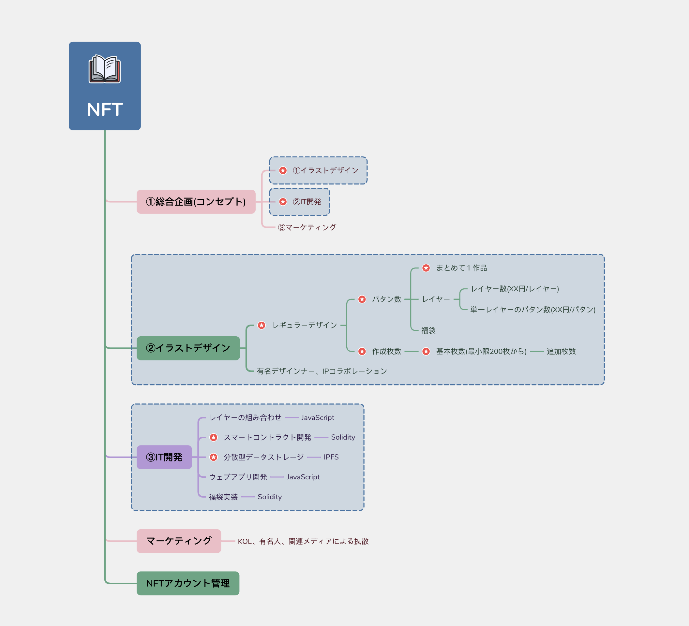

# Sakura Uncle NFT Collections

ERC721に基づいたNFTプロジェクトのデモです。2022年3月に制作され、学習と交流のみを目的としています。
This is a demo of an NFT project based on ERC721, created in March 2022, intended solely for learning and communication purposes.

# 下記の画像またはリンクをクリックすると、関連動画をご覧いただけます。
# Click the image or link below to watch the related video.
[Sakura Uncle NFT Series](https://www.youtube.com/watch?v=rE4-S_CSW9Q)

# NFTシリーズの開発・ローンチのワークフロー
# Workflow for the Creation and Launch of NFT series

今回のデモの実現を通じて、以下のNFTシリーズ発行プロセスをまとめました。
Through the implementation of this demo, I have summarized the following process for issuing an NFT series.

